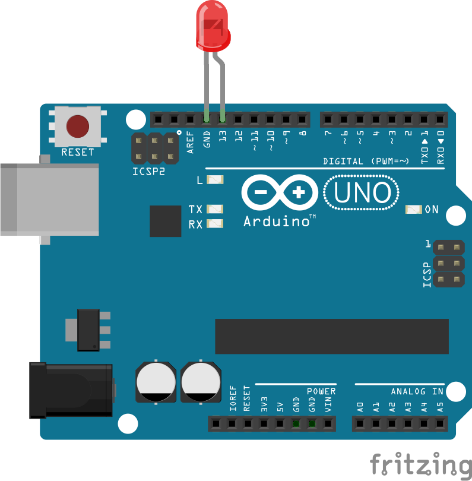

# Firebase Blinker
---
Blinks an LED on an arduino when a value changes in a firebase database.

## Installation
---
Prerequisites:
* Node
* An Arduino or similar [Johnny-Five compatible board](http://johnny-five.io/)

`git clone`

`npm install`

## Usage
Plug your LED into your board as shown below. The default pin is 13.

Then connect via USB and enter `npm start` in the console. The LED will blink off and on for four seconds when the watched database path's value changes.

### Configuration (config.js)
Use your own firebase project url and authentication. You can use any subdomain of firebaseio-demo.com without authenticating or creating a project, but note that the data could be changed or removed at any time.

Change watchedPath to the path in your database you want to watch. Use `null` to watch the entire database.

If you use a pin other than 13 for the LED, change it to match.
